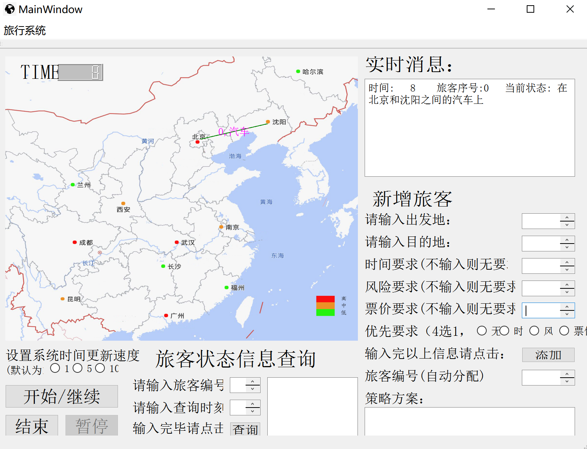

# Travel-Route-Recommendation-and-Simulation-System-based-on-COVID-19-Risk
## 📕BUPT Course: Project Laboratory: Algorithms and Data Structures
A travel recommendation and simulation system that can find the optimal travel route that satisfies multiple user preferences with the lowest risk.

---
## 👀Notice
This project is developed by Qt Creator.

For more details please refer to 

---

## 🖼Runtime Screenshot

---

## ✉Contact Us

Feel free to open an issue if you have any questions about our project.
